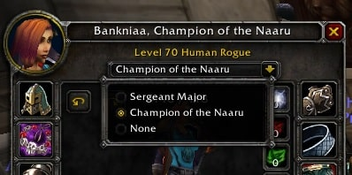

# PlayerTitleDropDown-WrathFix

Fixes player Title select dropdown UI bug by overriding default `PlayerTitleDropDown_Initialize()`, based on [/Interface_Wrath/FrameXML/PaperDollFrame.lua](https://github.com/tomrus88/BlizzardInterfaceCode/blob/wrath/Interface_Wrath/FrameXML/PaperDollFrame.lua#L359).

## Install

1. Download the latest [release](https://github.com/ThatKalle/PlayerTitleDropDown-WrathFix/releases) .zip, extract it to your `World of Warcraft\_classic_\Interface\AddOns\` folder. 
Make sure that the addon folder is named `PlayerTitleDropDown-WrathFix`. 
2. Reload your UI `/reload` or restart your game.
